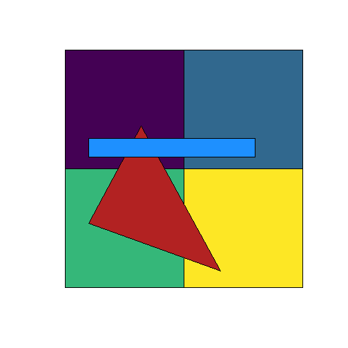
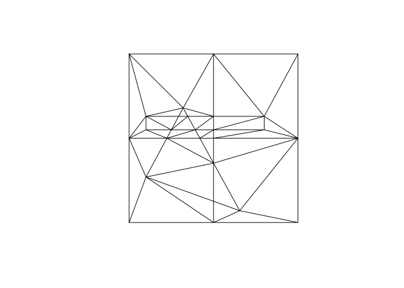
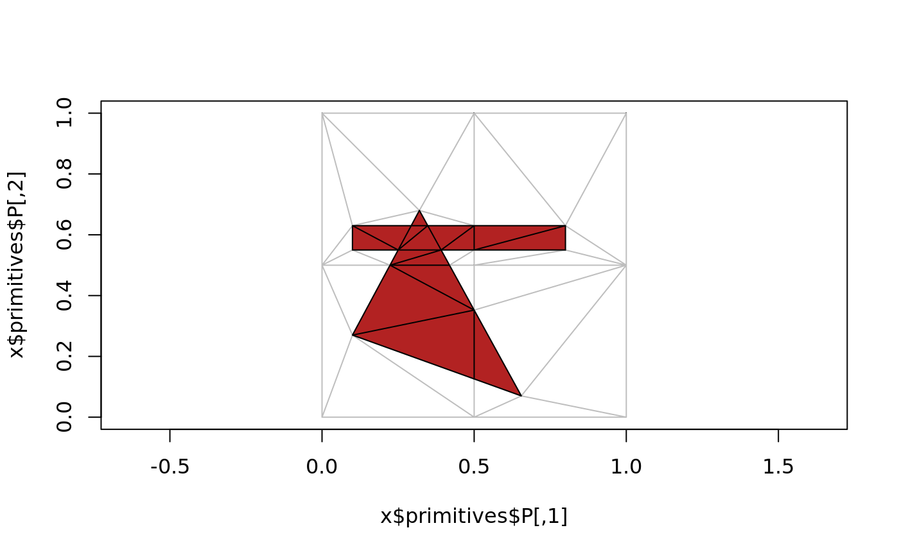
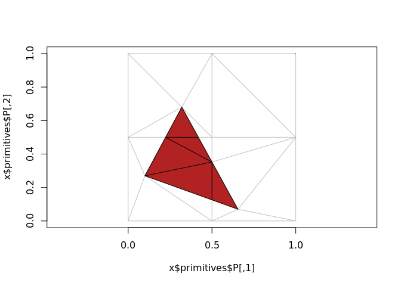
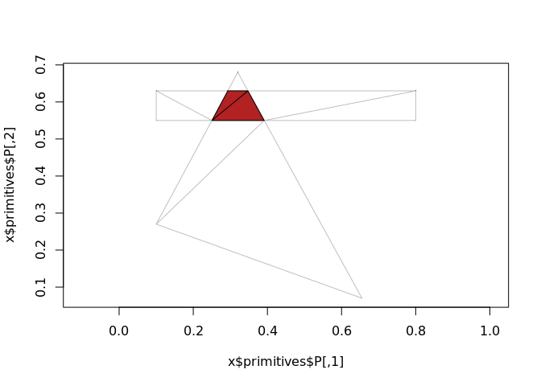

<!-- README.md is generated from README.Rmd. Please edit that file -->

# spacebucket

The goal of spacebucket is to provide flexible and intuitive overlay
methods familiar to GIS workflows.

WIP

## Installation

You can install the development version from
[GitHub](https://github.com/) with:

``` r
# install.packages("devtools")
devtools::install_github("mdsumner/spacebucket")
```

## Example

This example takes three built in data sets and merges them together as
an indexed mesh.

``` r
library(spacebucket)
#> Loading required package: sf
#> Linking to GEOS 3.6.2, GDAL 2.3.0, proj.4 4.9.3
plot(st_geometry(A), col = viridis::viridis(nrow(A)))
plot(st_geometry(B), col = "firebrick", add = TRUE)
plot(st_geometry(C), col = "dodgerblue", add = TRUE)
```



``` r

## summarize the contents
(bucket <- spacebucket(A, B, C))
#> SPACE BUCKET:
#> Layers:    3
#> Polygons:  6
#> Triangles: 42
#> (Overlaps: 15)

## show the components pieces
plot(bucket, asp = 1)
```



The next stage is to then pull out the intersection layer, currently we
only have a function to plot the identified triangles - but work to come
will identify them individually and copy attributes from the input
layers appropriately.

``` r
## there's an error somewhere, see that rogue triangle?
spacebucket:::sb_intersection(bucket, col = "firebrick")
```



``` r

## but it works with pairs
spacebucket:::sb_intersection(spacebucket(A, B), col = "firebrick")
```



``` r

spacebucket:::sb_intersection(spacebucket(C, B), col = "firebrick")
```


