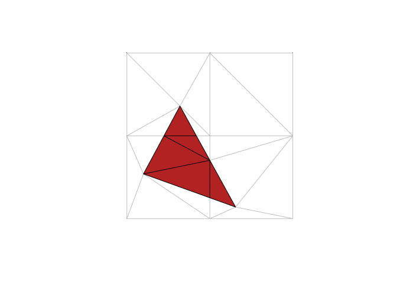

<!-- README.md is generated from README.Rmd. Please edit that file -->

# spacebucket

The goal of spacebucket is to provide flexible and intuitive overlay
methods familiar to GIS workflows. This works by doing the obvious
finite-element decomposition of all component edges in all inputs into
triangles. Then triangles *instances* are classified (by
point-in-polygon lookup) by inclusion within paths within objects within
layers.

The resulting mesh and inputs and indexes can be used to derive complex
relationships between layers. Spacebucket is modelled on the concept of
**data fusion** from a now defunct commercial package called Eonfusion.
It relies on the RTriangle package which is licensed CC BY-NC-SA 4.0,
but could be modified to use the less restrictive `decido` package.

WIP

## Installation

You can install the development version from
[GitHub](https://github.com/) with:

``` r
# install.packages("devtools")
devtools::install_github("mdsumner/spacebucket")
```

## Example

This example takes three built in data sets and merges them together as
an indexed mesh.

``` r
library(spacebucket)
#> Loading required package: sf
#> Linking to GEOS 3.6.2, GDAL 2.3.0, proj.4 4.9.3
plot(st_geometry(A), col = viridis::viridis(nrow(A)))
plot(st_geometry(B), col = "firebrick", add = TRUE)
plot(st_geometry(C), col = "dodgerblue", add = TRUE)
```


``` r

## summarize the contents
(bucket <- spacebucket(A, B, C))
#> SPACE BUCKET:
#> Layers:    3
#> Polygons:  6
#> Triangles: 42
#> (Overlaps: 15)

## show the components pieces
plot(bucket, asp = 1)
```


The next stage is to then pull out the intersection layer, currently we
only have a function to plot the identified triangles - but work to come
will identify them individually and copy attributes from the input
layers appropriately.

``` r
spacebucket:::sb_intersection(bucket, col = "firebrick")
```


``` r

## it works with pairs or with multiple layers
spacebucket:::sb_intersection(spacebucket(A, B), col = "firebrick")
```



``` r

spacebucket:::sb_intersection(spacebucket(C, B), col = "firebrick")
```


``` r


spacebucket:::sb_intersection(spacebucket(C, B, A, st_jitter(A, 0.1)), col = "firebrick")
```


